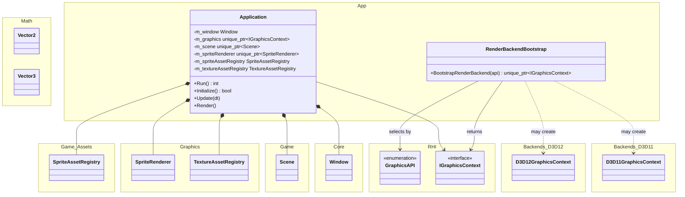

# Xelqoria.App Class Diagram

```mermaid
classDiagram
    direction TB

    namespace Core {
        class Window
    }

    namespace RHI {
        class GraphicsAPI {
            <<enumeration>>
        }

        class IGraphicsContext {
            <<interface>>
        }
    }

    namespace Math {
        class Vector2
        class Vector3
    }

    namespace Graphics {
        class SpriteRenderer
        class TextureAssetRegistry
    }

    namespace Game {
        class Scene
    }

    namespace Game_Assets {
        class SpriteAssetRegistry
    }

    namespace Backends_D3D11 {
        class D3D11GraphicsContext
    }

    namespace Backends_D3D12 {
        class D3D12GraphicsContext
    }

    namespace App {
        class Application {
            -m_window Window
            -m_graphics unique_ptr~IGraphicsContext~
            -m_scene unique_ptr~Scene~
            -m_spriteRenderer unique_ptr~SpriteRenderer~
            -m_spriteAssetRegistry SpriteAssetRegistry
            -m_textureAssetRegistry TextureAssetRegistry
            +Run() int
            +Initialize() bool
            +Update(dt)
            +Render()
        }

        class RenderBackendBootstrap {
            +BootstrapRenderBackend(api) unique_ptr~IGraphicsContext~
        }
    }

    Application *-- Window
    Application *-- Scene
    Application *-- SpriteRenderer
    Application *-- SpriteAssetRegistry
    Application *-- TextureAssetRegistry
    Application --> IGraphicsContext

    RenderBackendBootstrap --> GraphicsAPI : selects by
    RenderBackendBootstrap --> IGraphicsContext : returns
    RenderBackendBootstrap ..> D3D11GraphicsContext : may create
    RenderBackendBootstrap ..> D3D12GraphicsContext : may create
```
