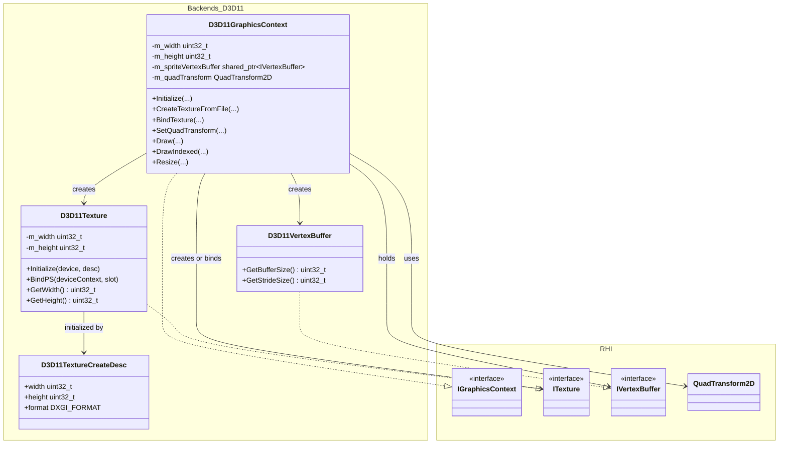

# Xelqoria.Backends.D3D11 Class Diagram

```mermaid
classDiagram
    direction TB

    namespace RHI {
        class IGraphicsContext {
            <<interface>>
        }

        class ITexture {
            <<interface>>
        }

        class IVertexBuffer {
            <<interface>>
        }

        class QuadTransform2D
    }

    namespace Backends_D3D11 {
        class D3D11TextureCreateDesc {
            +width uint32_t
            +height uint32_t
            +format DXGI_FORMAT
        }

        class D3D11Texture {
            -m_width uint32_t
            -m_height uint32_t
            +Initialize(device, desc)
            +BindPS(deviceContext, slot)
            +GetWidth() uint32_t
            +GetHeight() uint32_t
        }

        class D3D11VertexBuffer {
            +GetBufferSize() uint32_t
            +GetStrideSize() uint32_t
        }

        class D3D11GraphicsContext {
            -m_width uint32_t
            -m_height uint32_t
            -m_spriteVertexBuffer shared_ptr~IVertexBuffer~
            -m_quadTransform QuadTransform2D
            +Initialize(...)
            +CreateTextureFromFile(...)
            +BindTexture(...)
            +SetQuadTransform(...)
            +Draw(...)
            +DrawIndexed(...)
            +Resize(...)
        }
    }

    D3D11GraphicsContext ..|> IGraphicsContext
    D3D11Texture ..|> ITexture
    D3D11VertexBuffer ..|> IVertexBuffer

    D3D11GraphicsContext --> ITexture : creates or binds
    D3D11GraphicsContext --> IVertexBuffer : holds
    D3D11GraphicsContext --> QuadTransform2D : uses
    D3D11GraphicsContext --> D3D11Texture : creates
    D3D11GraphicsContext --> D3D11VertexBuffer : creates
    D3D11Texture --> D3D11TextureCreateDesc : initialized by
```
