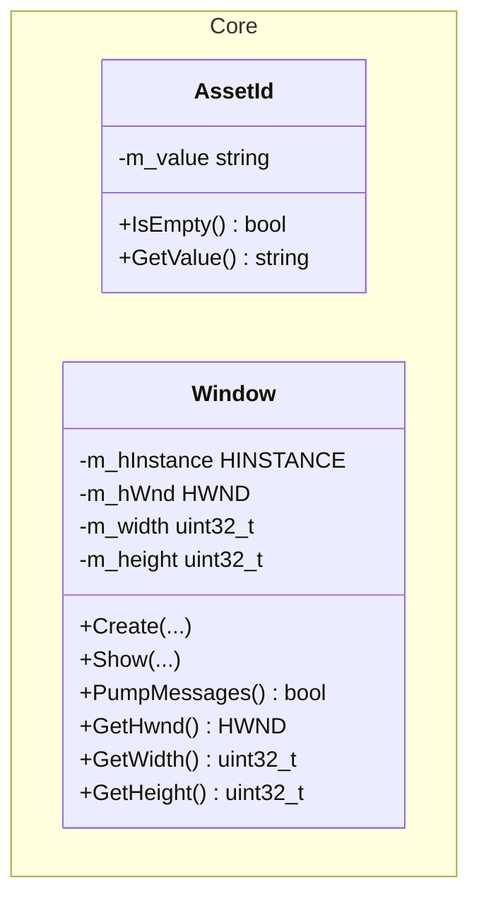

# Xelqoria.Core Class Diagram

```mermaid
classDiagram
    direction TB

    namespace Core {
        class AssetId {
            -m_value string
            +IsEmpty() bool
            +GetValue() string
        }

        class Window {
            -m_hInstance HINSTANCE
            -m_hWnd HWND
            -m_width uint32_t
            -m_height uint32_t
            +Create(...)
            +Show(...)
            +PumpMessages() bool
            +GetHwnd() HWND
            +GetWidth() uint32_t
            +GetHeight() uint32_t
        }
    }
```
