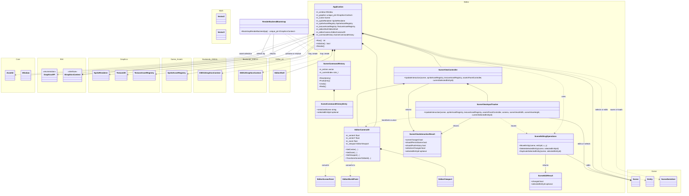

# Xelqoria.Editor Class Diagram

```mermaid
classDiagram
    direction TB

    namespace Core {
        class AssetId
        class Window
    }

    namespace RHI {
        class GraphicsAPI {
            <<enumeration>>
        }

        class IGraphicsContext {
            <<interface>>
        }
    }

    namespace Math {
        class Vector2
        class Vector3
    }

    namespace Graphics {
        class SpriteRenderer
        class Texture2D
        class TextureAssetRegistry
    }

    namespace Game {
        class Scene
        class Entity
        class SceneSerializer
    }

    namespace Game_Assets {
        class SpriteAssetRegistry
    }

    namespace Backends_D3D11 {
        class D3D11GraphicsContext
    }

    namespace Backends_D3D12 {
        class D3D12GraphicsContext
    }

    namespace Editor_UI {
        class EditorShell
    }

    namespace Editor {
        class EditorScreenPoint
        class EditorWorldPoint
        class EditorViewport

        class EditorCamera2D {
            -m_centerX float
            -m_centerY float
            -m_zoom float
            -m_viewport EditorViewport
            +SetCenter(...)
            +SetZoom(...)
            +SetViewport(...)
            +TransformScreenToWorld(...)
        }

        class SceneCommandHistoryEntry {
            +serializedScene string
            +selectedEntityId optional
        }

        class SceneCommandHistory {
            -m_entries vector
            -m_currentIndex size_t
            +Reset(entry)
            +Push(entry)
            +Undo()
            +Redo()
        }

        class SceneEditResult {
            +changed bool
            +selectedEntityId optional
        }

        class SceneViewInteractionResult {
            +sceneChanged bool
            +shouldPersistScene bool
            +shouldPushHistory bool
            +selectionChanged bool
            +selectedEntityId optional
        }

        class SceneViewInputTracker {
            +UpdateInteraction(scene, spriteAssetRegistry, textureAssetRegistry, assetsPanelController, camera, sceneViewWidth, sceneViewHeight, currentSelectedEntityId)
        }

        class SceneViewController {
            +UpdateInteraction(scene, spriteAssetRegistry, textureAssetRegistry, assetsPanelController, currentSelectedEntityId)
        }

        class SceneEditingOperations {
            +MoveEntity(scene, entityId, x, y)
            +DeleteSelectedEntity(scene, selectedEntityId)
            +DuplicateSelectedEntity(scene, selectedEntityId)
        }

        class Application {
            -m_window Window
            -m_graphics unique_ptr~IGraphicsContext~
            -m_scene Scene
            -m_spriteRenderer SpriteRenderer
            -m_spriteAssetRegistry SpriteAssetRegistry
            -m_textureAssetRegistry TextureAssetRegistry
            -m_editorShell EditorShell
            -m_editorCamera EditorCamera2D
            -m_commandHistory SceneCommandHistory
            +Run() int
            +Initialize() bool
            +Render()
        }

        class RenderBackendBootstrap {
            +BootstrapRenderBackend(api) unique_ptr~IGraphicsContext~
        }
    }

    EditorCamera2D *-- EditorViewport
    EditorCamera2D ..> EditorScreenPoint : converts
    EditorCamera2D ..> EditorWorldPoint : converts to

    SceneCommandHistory *-- SceneCommandHistoryEntry
    SceneViewController *-- SceneViewInputTracker
    SceneViewController *-- EditorCamera2D
    SceneViewController --> SceneViewInteractionResult : returns
    SceneViewInputTracker --> Scene : edits or selects
    SceneViewInputTracker --> SceneViewInteractionResult : returns
    SceneViewInputTracker ..> SceneEditingOperations : moves
    SceneViewInputTracker ..> EditorCamera2D : transforms cursor
    SceneEditingOperations --> Scene : edits
    SceneEditingOperations --> SceneEditResult : returns

    Application *-- Window
    Application *-- EditorShell
    Application *-- SceneCommandHistory
    Application *-- EditorCamera2D
    Application *-- SceneViewController
    Application --> Scene
    Application --> SpriteRenderer
    Application --> SpriteAssetRegistry
    Application --> TextureAssetRegistry
    Application --> IGraphicsContext
    Application ..> SceneEditingOperations : uses
    Application ..> SceneSerializer : saves or loads
    Application ..> Entity : selects or edits
    Application ..> AssetId : asset selection
    Application ..> Texture2D : preview or resolve

    RenderBackendBootstrap --> GraphicsAPI : selects by
    RenderBackendBootstrap --> IGraphicsContext : returns
    RenderBackendBootstrap ..> D3D11GraphicsContext : may create
    RenderBackendBootstrap ..> D3D12GraphicsContext : may create
```
