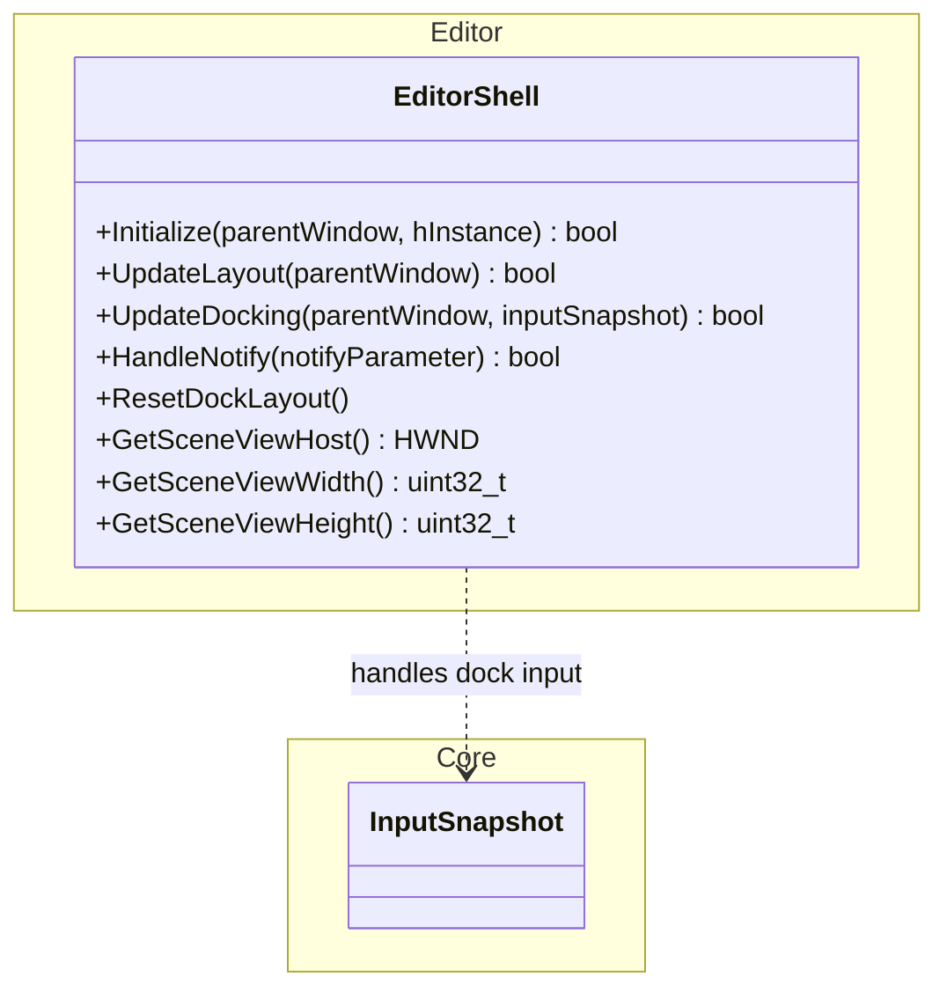

# Xelqoria.Editor.UI Class Diagram

```mermaid
classDiagram
    direction TB

    namespace Core {
        class InputSnapshot
    }

    namespace Editor {
        class EditorShell {
            +Initialize(parentWindow, hInstance) bool
            +UpdateLayout(parentWindow) bool
            +UpdateDocking(parentWindow, inputSnapshot) bool
            +HandleNotify(notifyParameter) bool
            +ResetDockLayout()
            +GetSceneViewHost() HWND
            +GetSceneViewWidth() uint32_t
            +GetSceneViewHeight() uint32_t
        }
    }

    EditorShell ..> InputSnapshot : handles dock input
```
