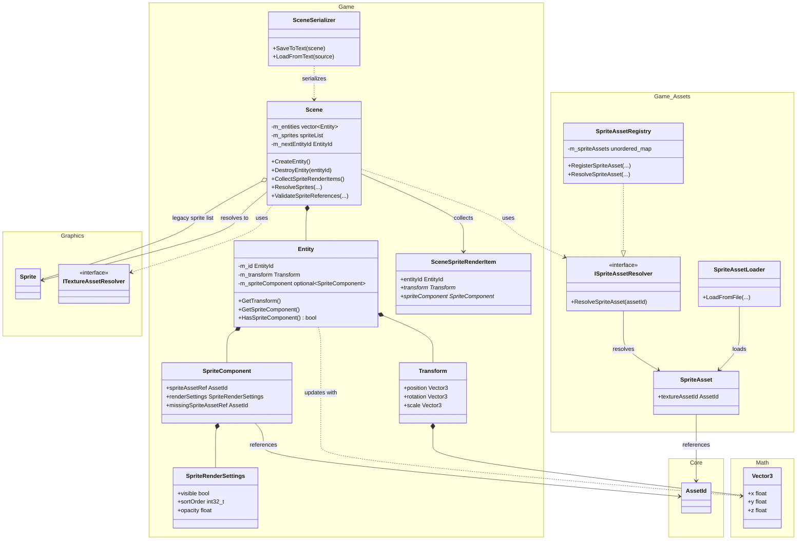

# Xelqoria.Game Class Diagram

```mermaid
classDiagram
    direction TB

    namespace Core {
        class AssetId
    }

    namespace Graphics {
        class Sprite
        class ITextureAssetResolver {
            <<interface>>
        }
    }

    namespace Math {
        class Vector3 {
            +x float
            +y float
            +z float
        }
    }

    namespace Game_Assets {
        class SpriteAsset {
            +textureAssetId AssetId
        }

        class ISpriteAssetResolver {
            <<interface>>
            +ResolveSpriteAsset(assetId)
        }

        class SpriteAssetRegistry {
            -m_spriteAssets unordered_map
            +RegisterSpriteAsset(...)
            +ResolveSpriteAsset(...)
        }

        class SpriteAssetLoader {
            +LoadFromFile(...)
        }
    }

    namespace Game {
        class Transform {
            +position Vector3
            +rotation Vector3
            +scale Vector3
        }

        class SpriteRenderSettings {
            +visible bool
            +sortOrder int32_t
            +opacity float
        }

        class SpriteComponent {
            +spriteAssetRef AssetId
            +renderSettings SpriteRenderSettings
            +missingSpriteAssetRef AssetId
        }

        class Entity {
            -m_id EntityId
            -m_transform Transform
            -m_spriteComponent optional~SpriteComponent~
            +GetTransform()
            +GetSpriteComponent()
            +HasSpriteComponent() bool
        }

        class SceneSpriteRenderItem {
            +entityId EntityId
            +transform Transform*
            +spriteComponent SpriteComponent*
        }

        class Scene {
            -m_entities vector~Entity~
            -m_sprites spriteList
            -m_nextEntityId EntityId
            +CreateEntity()
            +DestroyEntity(entityId)
            +CollectSpriteRenderItems()
            +ResolveSprites(...)
            +ValidateSpriteReferences(...)
        }

        class SceneSerializer {
            +SaveToText(scene)
            +LoadFromText(source)
        }
    }

    SpriteAssetRegistry ..|> ISpriteAssetResolver
    SpriteAsset --> AssetId : references
    ISpriteAssetResolver --> SpriteAsset : resolves

    Entity ..> Vector3 : updates with
    Transform *-- Vector3
    SpriteComponent --> AssetId : references
    SpriteComponent *-- SpriteRenderSettings
    Entity *-- Transform
    Entity *-- SpriteComponent
    Scene *-- Entity
    Scene o-- Sprite : legacy sprite list
    Scene --> SceneSpriteRenderItem : collects
    Scene ..> ISpriteAssetResolver : uses
    Scene ..> ITextureAssetResolver : uses
    Scene --> Sprite : resolves to
    SceneSerializer ..> Scene : serializes
    SpriteAssetLoader --> SpriteAsset : loads
```
