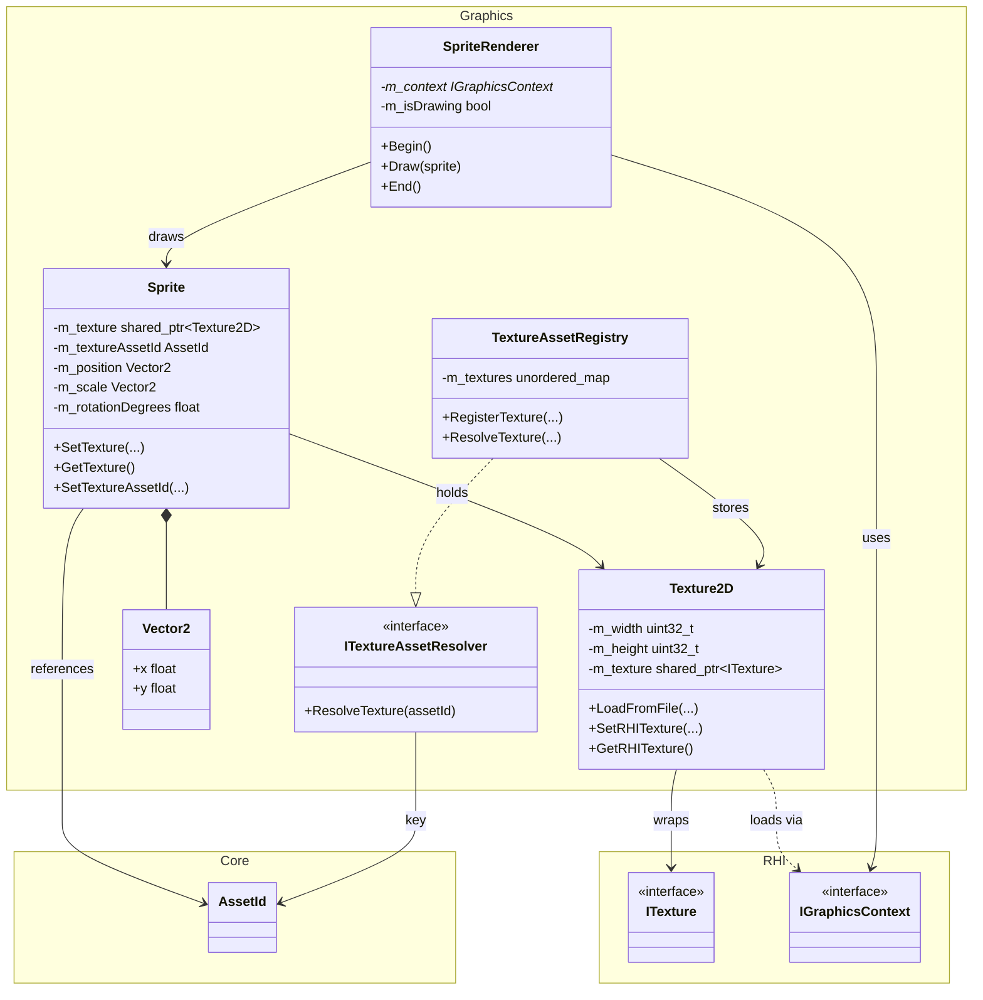

# Xelqoria.Graphics Class Diagram

```mermaid
classDiagram
    direction TB

    namespace Core {
        class AssetId
    }

    namespace RHI {
        class ITexture {
            <<interface>>
        }

        class IGraphicsContext {
            <<interface>>
        }
    }

    namespace Graphics {
        class Texture2D {
            -m_width uint32_t
            -m_height uint32_t
            -m_texture shared_ptr~ITexture~
            +LoadFromFile(...)
            +SetRHITexture(...)
            +GetRHITexture()
        }

        class Vector2 {
            +x float
            +y float
        }

        class Sprite {
            -m_texture shared_ptr~Texture2D~
            -m_textureAssetId AssetId
            -m_position Vector2
            -m_scale Vector2
            -m_rotationDegrees float
            +SetTexture(...)
            +GetTexture()
            +SetTextureAssetId(...)
        }

        class SpriteRenderer {
            -m_context IGraphicsContext*
            -m_isDrawing bool
            +Begin()
            +Draw(sprite)
            +End()
        }

        class ITextureAssetResolver {
            <<interface>>
            +ResolveTexture(assetId)
        }

        class TextureAssetRegistry {
            -m_textures unordered_map
            +RegisterTexture(...)
            +ResolveTexture(...)
        }
    }

    TextureAssetRegistry ..|> ITextureAssetResolver
    Texture2D --> ITexture : wraps
    Texture2D ..> IGraphicsContext : loads via
    Sprite --> Texture2D : holds
    Sprite --> AssetId : references
    Sprite *-- Vector2
    SpriteRenderer --> IGraphicsContext : uses
    SpriteRenderer --> Sprite : draws
    ITextureAssetResolver --> AssetId : key
    TextureAssetRegistry --> Texture2D : stores
```
