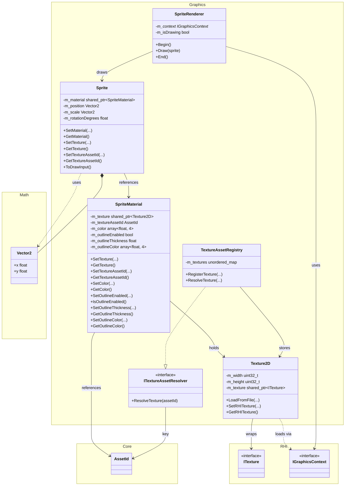

# Xelqoria.Graphics Class Diagram

```mermaid
classDiagram
    direction TB

    namespace Core {
        class AssetId
    }

    namespace RHI {
        class ITexture {
            <<interface>>
        }

        class IGraphicsContext {
            <<interface>>
        }
    }

    namespace Math {
        class Vector2 {
            +x float
            +y float
        }
    }

    namespace Graphics {
        class Texture2D {
            -m_width uint32_t
            -m_height uint32_t
            -m_texture shared_ptr~ITexture~
            +LoadFromFile(...)
            +SetRHITexture(...)
            +GetRHITexture()
        }

        class SpriteMaterial {
            -m_texture shared_ptr~Texture2D~
            -m_textureAssetId AssetId
            -m_color array~float, 4~
            -m_outlineEnabled bool
            -m_outlineThickness float
            -m_outlineColor array~float, 4~
            +SetTexture(...)
            +GetTexture()
            +SetTextureAssetId(...)
            +GetTextureAssetId()
            +SetColor(...)
            +GetColor()
            +SetOutlineEnabled(...)
            +IsOutlineEnabled()
            +SetOutlineThickness(...)
            +GetOutlineThickness()
            +SetOutlineColor(...)
            +GetOutlineColor()
        }

        class Sprite {
            -m_material shared_ptr~SpriteMaterial~
            -m_position Vector2
            -m_scale Vector2
            -m_rotationDegrees float
            +SetMaterial(...)
            +GetMaterial()
            +SetTexture(...)
            +GetTexture()
            +SetTextureAssetId(...)
            +GetTextureAssetId()
            +ToDrawInput()
        }

        class SpriteRenderer {
            -m_context IGraphicsContext*
            -m_isDrawing bool
            +Begin()
            +Draw(sprite)
            +End()
        }

        class ITextureAssetResolver {
            <<interface>>
            +ResolveTexture(assetId)
        }

        class TextureAssetRegistry {
            -m_textures unordered_map
            +RegisterTexture(...)
            +ResolveTexture(...)
        }
    }

    TextureAssetRegistry ..|> ITextureAssetResolver
    Texture2D --> ITexture : wraps
    Texture2D ..> IGraphicsContext : loads via
    SpriteMaterial --> Texture2D : holds
    SpriteMaterial --> AssetId : references
    Sprite --> SpriteMaterial : references
    Sprite ..> Vector2 : uses
    Sprite *-- Vector2
    SpriteRenderer --> IGraphicsContext : uses
    SpriteRenderer --> Sprite : draws
    ITextureAssetResolver --> AssetId : key
    TextureAssetRegistry --> Texture2D : stores
```
