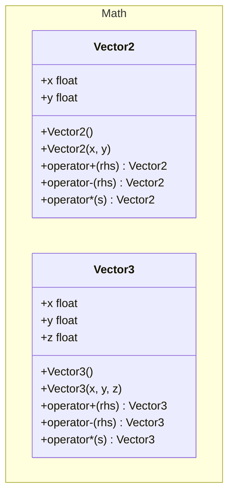

# Xelqoria.Math Class Diagram

```mermaid
classDiagram
    direction TB

    namespace Math {
        class Vector2 {
            +x float
            +y float
            +Vector2()
            +Vector2(x, y)
            +operator+(rhs) Vector2
            +operator-(rhs) Vector2
            +operator*(s) Vector2
        }

        class Vector3 {
            +x float
            +y float
            +z float
            +Vector3()
            +Vector3(x, y, z)
            +operator+(rhs) Vector3
            +operator-(rhs) Vector3
            +operator*(s) Vector3
        }
    }
```
