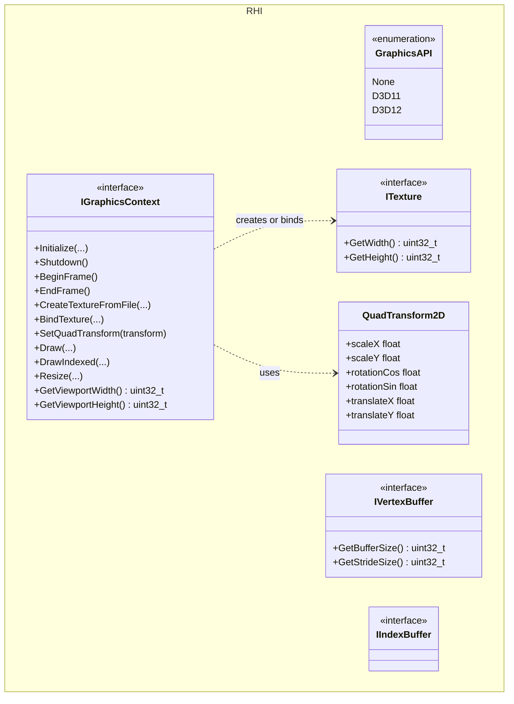

# Xelqoria.RHI Class Diagram

```mermaid
classDiagram
    direction TB

    namespace RHI {
        class GraphicsAPI {
            <<enumeration>>
            None
            D3D11
            D3D12
        }

        class QuadTransform2D {
            +scaleX float
            +scaleY float
            +rotationCos float
            +rotationSin float
            +translateX float
            +translateY float
        }

        class ITexture {
            <<interface>>
            +GetWidth() uint32_t
            +GetHeight() uint32_t
        }

        class IVertexBuffer {
            <<interface>>
            +GetBufferSize() uint32_t
            +GetStrideSize() uint32_t
        }

        class IIndexBuffer {
            <<interface>>
        }

        class IGraphicsContext {
            <<interface>>
            +Initialize(...)
            +Shutdown()
            +BeginFrame()
            +EndFrame()
            +CreateTextureFromFile(...)
            +BindTexture(...)
            +SetQuadTransform(transform)
            +Draw(...)
            +DrawIndexed(...)
            +Resize(...)
            +GetViewportWidth() uint32_t
            +GetViewportHeight() uint32_t
        }
    }

    IGraphicsContext ..> ITexture : creates or binds
    IGraphicsContext ..> QuadTransform2D : uses
```
